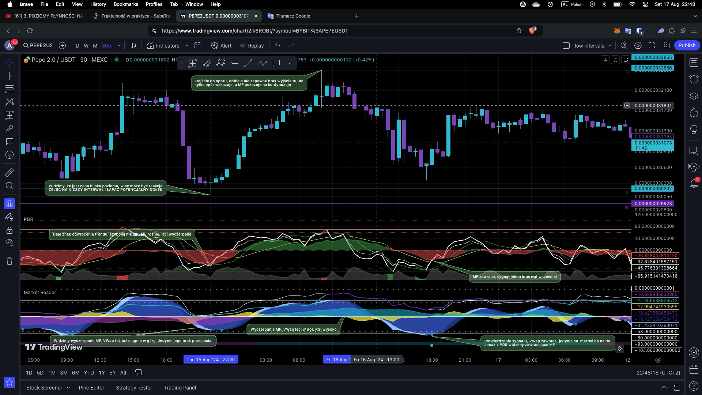

## Dywergencje
Rozbieżności pomiędzy oscylatorami momentum a ruchem cenowym
![[Pasted image 20240818211017.png]]
Najłatwiej patrzyć w ten sposób:
Dla jawnych
- dół + dół -> Czy są przeciwstawne ? -> TAK to znaczy, że dywergencja
- góra + góra -> Czy są przeciwstawne ? -> TAK to znaczy, że dywergencja- ![[Pasted image 20240818212810.png]]
Dla ukrytych to samo, tylko ona wskazuje na KONTYNUACJĘ TRENDU

## W połączeniu z momentum i Money Flow
![[Pasted image 20240818214016.png]]

## Money Flow

