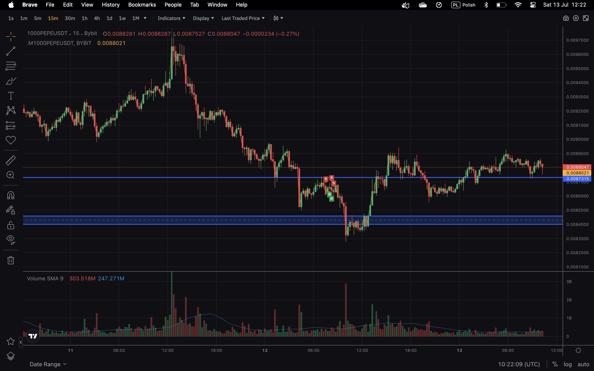

 
# Trade summary
### Why Enter, was a good choise ?
I enter the trade to have a position. It was a bad choose, i choose wrong level to enter a trade, without any strong supply demnand zone, trend lines. Then the trade went into my direct, but sum of, i want enter in wrong place, so the good directon later isn't a good point, it's a bit a lucky.
	
### Why this position size, was a good choise ?
It was a good position size, i risk maz 5% of capital.

### Why SL, TP on this levels, was a good choise ?
I set SL at good level, it cut my losses in right place and a lost only ~15$. I don't set TP, so it could have wrong impact on the trade, it can be too long or turn from good trade to wrong.

### Did I follow trading rules ?
No, i don't follow entry rules and don't follow rule that no position is also a position.

### Was is a good / bad trade ?
It was bad trade, to fast.

# Day suurond

### Today feelings
Mixed, I have a bit wrong feelings in personal live, but in the job a did a very good stuff.

### Long-term trend
correction with consolidation

### Special economic news, announcements, macroeconomy conditions