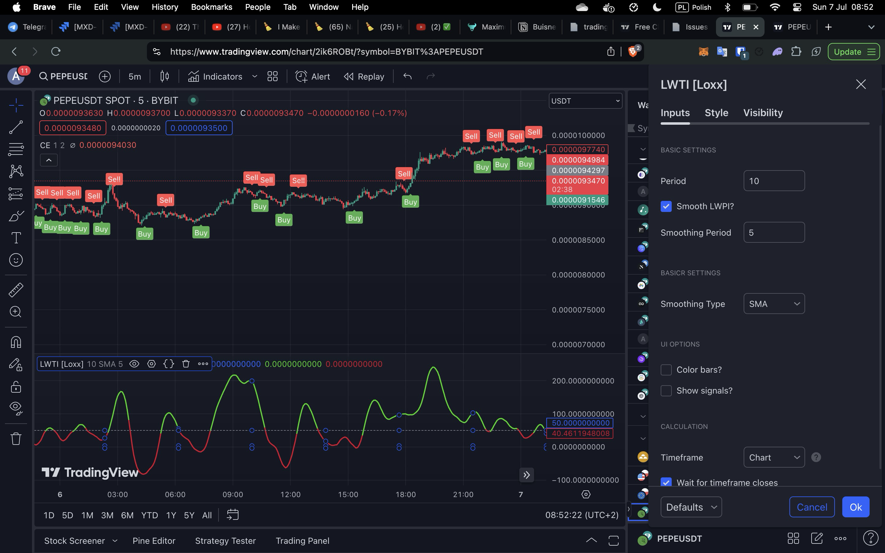

 
1. Add supply and demand zones on the chart. Use indicator for it and also add myself using simple lines

#### other helpfull indicators to consider

Help to mantain positon, when it show the oposite direction, close the trade. So when i eneter to long based on other conditions, and i see that this indicator also start show the long, but after a some moment it shos short, consider to close position and take profit or cut losses.
