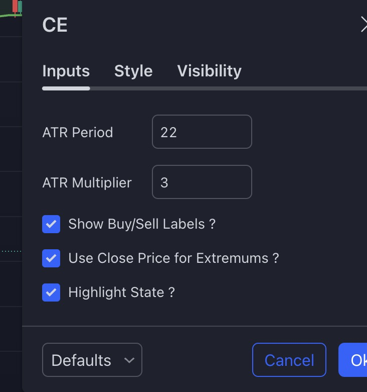

 
This indicator connections (adding ema-trend-meter) can imporve the signals. `ema-trend-meter` they should be all in the same colors for 2 timeframe and signal from the `chandelier-exit` should apper, then enter the posioton.

PineScript of the `ema-trend-meter`:
```
//version=5
indicator("EMA Trend Meter")
import TradingView/ta/7

len1 = input(13, 'Length EMA1')
len2 = input(21, 'Length EMA1')
len3 = input(55, 'Length EMA1')
K_ = input(3, 'Smooth K')
D_ = input(3, 'Smooth D')
L1 = input(14, 'RSI Length')
L2 = input(14, 'STO Length')

EMA0 = ta.ema(close, 1)
EMA1 = ta.ema(close, len1)
EMA2 = ta.ema(close, len2)
EMA3 = ta.ema(close, len3)

[a, b] = ta.stochRsi(L1, L2, K_, D_, close)
Bull1 = EMA1 < EMA0
Bull2 = EMA2 < EMA0
Bull3 = EMA3 < EMA0

plot(30, 'S_R', color = a > b ? color.gray : a < b ? color.black : na, linewidth=4, style=plot.style_circles)
plot(20, 'EMA1', color = Bull1 ? color.green : color.red, linewidth=4, style=plot.style_circles)
plot(10, 'EMA2', color = Bull2 ? color.green : color.red, linewidth=4, style=plot.style_circles)
plot(0, 'EMA3', color = Bull3 ? color.green : color.red, linewidth=4, style=plot.style_circles)
```


## strategies


#### One
Enter when:
- `ema-trend-meter` all colors are the same
- `chandelier-exit` is bullish
 
#### Two
Enter when:
- `chandelier-exit` give buy signall
- `ema-trend-meter` all colors are the same
 
#### Three
Enter when:
- `chandelier-exit` give buy signall
- `ema-trend-meter` all colors are the same for 2 timeframes
 
#### Four
Enter when:
- `ema-trend-meter` all colors are the same for 2 timeframes
- `chandelier-exit` is bullish
 
#### Five
Add to all of the strategies
- `suplly-demand-zones` add to avoid fast trend revers
 

## For now don't use dou too investing too much time in backtesting using PineScript
 
#### Other settings
