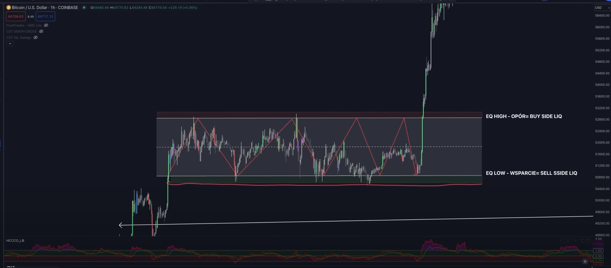
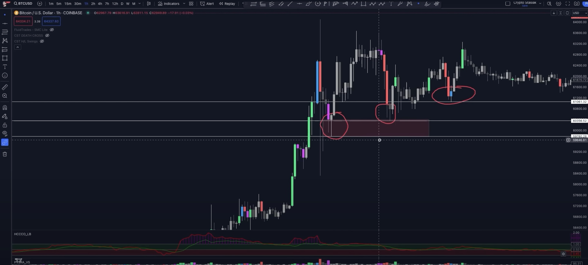

 
First we must designate `seel side` and `buy side` zones. At the top (a bit higher than current hight) there is `buy side`, becouse there a lot of SL for shorts which will be open a bit lower and a bit higher there are `buy order` for new longs, when the consolidation breakouts. The same for `sell zone` at the bottom.

I should buy in place where `smart money` buy, so it will be where `retail traders` sells ? Don't buy/sell to fast.
Also observer who produce the price movements. When the move from bottom to top is produced by `smart money`, probably there will be breakout from consolidation. To check this, study `order flow` in live and `atas` 

## Candlestick patterns

Thanks to them We can conclude the sell / buy preasure, trend reversal etc.

## Sell side liquidity

It's a range of retail stop loss orders. They are often triggered, so place own stop loss in a bit different place, a bit lower. Here are a example of `sell side liqudity`, we are focusing on `wicks`.

